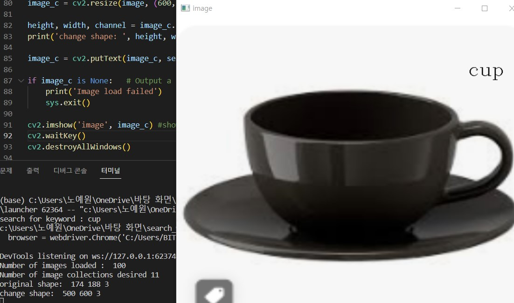
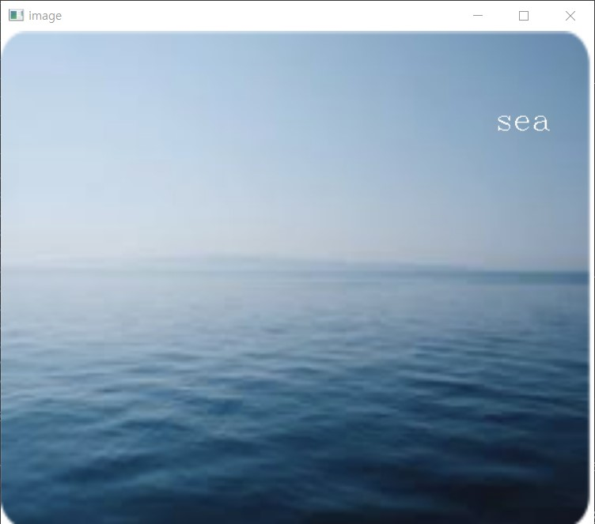
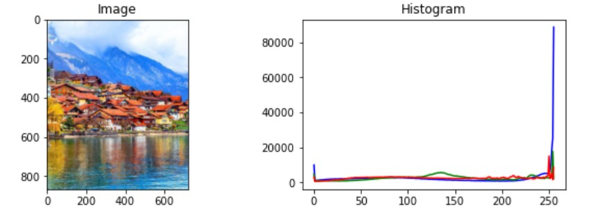
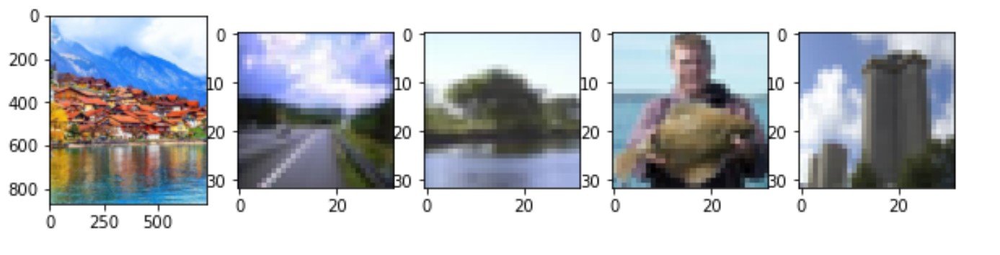

<<<<<<< HEAD

# Extract images similar to search terms (search_similar_images.py) / 202234911 유연이
---

## Description
1. Enter a search term, the simliar images are saved (crawing)
2. Extract similar images from dataset using opencv
3. Similarity measurement using Hamming distance (pictures may be slightly different)
4. Only those with a Hamming distance of less than 0.2, that is, those with a similarity of 80% or more are output.
---
## Precautions
1. opencv should be installed.
2. Unzip the file named '101_ObjectCategories.tar.gz'. (An image dataset of 10,000 photos)
3. selenium install : pip install selenium==3.14.1
4. beautifulsoup install : pip install beautifulsoup4
5. Install the 'chromedriver.exe' for your version of chrome. 
---
## Result

---
## Reference 
- data set : https://data.caltech.edu/records/mzrjq-6wc02
- https://github.com/BaekKyunShin/OpenCV_Project_Python
- https://exit9509.tistory.com/m/17
---

# Detect the images type is portrait or landscape (detect_image_type.py) / 202234901 설지은
---

## Description
1. Enter the two images.
2. Detect the person's front face use openCV Haar Cascade.
3. Detect the person's body use openCV HOG.
4. If person's face or body detected than prints out a portrait picture.
5. If a person is not detected, it prints out a landscape picture.
6. Show the two images. If a person is detected, the detected part is displayed in the square box
---
## Precautions
1. opencv should be installed.
2. Used package 'haarcascade_frontalface_default.xml'
---
## How to implement
1. Change the line 19, 20 of detect_image_type.py
2. Change the image files name to change the image.
---
## Result

---
# Reference
- data set: https://github.com/opencv/opencv/blob/master/data/haarcascades/haarcascade_frontalface_default.xml
- https://suy379.tistory.com/91
- https://note.nkmk.me/en/python-opencv-hconcat-vconcat-np-tile/
---

# Extract the entered search word images (detect_search_word.py) / 202234885 노예원
---

## Description
1. Enter a keyword.
2. Crawls images based on keywords.
3. Crawling and reading one of the downloaded images.
4. Increase the size of the image, insert the keyword letter, and print it out
---
## Precautions
1. python and opencv should be installed
2. install selenium (pip install selenium) 
3. install beautifulsoup4 (pip install beautifulsoup4)  
4. install Chomedriver (https://chromedriver.chromium.org/downloads, Chromedriver.exe)
---
## Result

---
## Reference 
- https://durian9s-coding-tree.tistory.com/56
- https://goodthings4me.tistory.com/783
---

# Detect a picture that has the most similar color to the picture (detect_color.py) / 202234856 고민정
---

## Description
1. The program is executed.
2. Load the image file of the entered path.
3. Among the images to be searched, select five images that are most similar to the loaded image.
4. Retrieves the images to be searched.
5.  It is ordered based on similarity compared to the input image.
6.  Select the top five images in order of similarity.
7.  Displays the selected images.
8.  The program ends.
‘cifar-100_file.py’ creates a ‘test_image’ file and a ‘train_image’ file. The ‘train_image’ file becomes a dataset that finds similar pictures. The ‘pictures’ file combines all the images in the ‘train_image’ file into one. It doesn't matter if the image you want to input is a picture in cifar-100, but if it's an external image, you have to put it in ‘pictures’ file. The code is 'color.py'.It is located in both the 'color.py'  and the 'color_detecting.ipynb' file. It's the same code.
---
## Precaution
1. opencv should be installed.
2. numpy, matplotlib, pillow must be installed.
3. Need to download cifar-100 (pictures file)
4. After downloading cifar-100 and creating each image file in cifar-100_file.py, combine it into one image file to make the dataset one.
---
## How to implement
1. Enter the file name of the picture you want
2. A picture with a color similar to the image file you entered is printed out.
---
## Result

---
# Reference
- data set: https://www.cs.toronto.edu/~kriz/cifar.html
- https://mindw96.tistory.com/m/10
- https://velog.io/@och9854/F-16%ED%8C%8C%EC%9D%B4%EC%8D%AC%EC%9C%BC%EB%A1%9C-%EC%9D%B4%EB%AF%B8%EC%A7%80-%ED%8C%8C%EC%9D%BC-%EB%8B%A4%EB%A3%A8%EA%B8%B0
---

=======
version https://git-lfs.github.com/spec/v1
oid sha256:19a08e9dfbbb79212ceae9c2acdd9ae465edb2ed5c3adfad1198e4bc273b65d3
size 31
>>>>>>> e4a8a3e3d2b318a7a58a97b8f3cb4ccec94faed7
