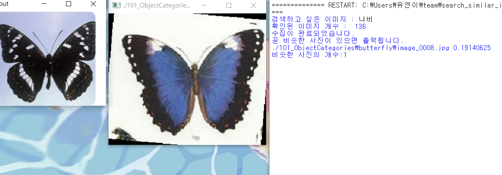
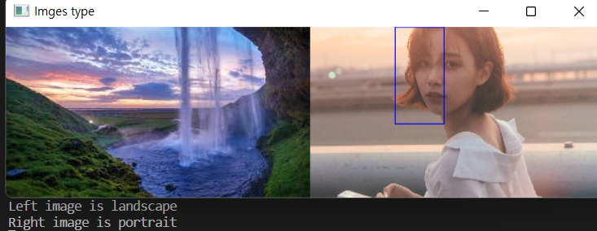
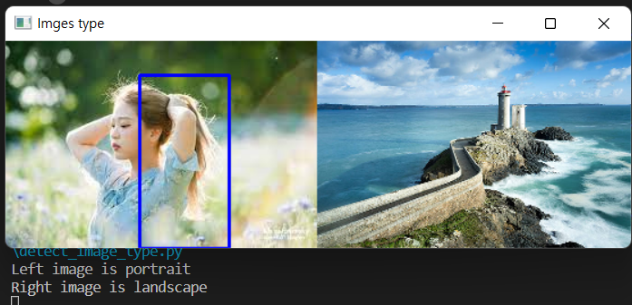

<<<<<<< HEAD

# Extract images similar to search terms (search_similar_images.py)
---

## Description
1. Enter a search term, the simliar images are saved (crawing)
2. Extract similar images from dataset using opencv
3. Similarity measurement using Hamming distance (pictures may be slightly different)
4. Only those with a Hamming distance of less than 0.2, that is, those with a similarity of 80% or more are output.
---
## Precautions
1. opencv should be installed.
2. Unzip the file named '101_ObjectCategories.tar.gz'. (An image dataset of 10,000 photos)
3. selenium install : pip install selenium==3.14.1
4. beautifulsoup install : pip install beautifulsoup4
5. Install the 'chromedriver.exe' for your version of chrome. 
---
## Result

---
## Reference 
- data set : https://data.caltech.edu/records/mzrjq-6wc02
- https://github.com/BaekKyunShin/OpenCV_Project_Python
- https://exit9509.tistory.com/m/17
---

# Detect the images type is portrait or landscape (detect_image_type.py)
---

## Description
1. Enter the two images.
2. Detect the person's front face use openCV Haar Cascade.
3. Detect the person's body use openCV HOG.
4. If person's face or body detected than prints out a portrait picture.
5. If a person is not detected, it prints out a landscape picture.
6. Show the two images. If a person is detected, the detected part is displayed in the square box
---
## Precaution
1. opencv should be installed.
2. Used package 'haarcascade_frontalface_default.xml'
---
## How to implement
1. Change the line 19, 20 of detect_image_type.py
2. Change the image files name to change the image.
---
## Result

---
# Reference
- data set: https://github.com/opencv/opencv/blob/master/data/haarcascades/haarcascade_frontalface_default.xml
- https://suy379.tistory.com/91
- https://note.nkmk.me/en/python-opencv-hconcat-vconcat-np-tile/
---

## 여기부터 이어서 쓰기 위에 형식 참고

=======
version https://git-lfs.github.com/spec/v1
oid sha256:19a08e9dfbbb79212ceae9c2acdd9ae465edb2ed5c3adfad1198e4bc273b65d3
size 31
>>>>>>> e4a8a3e3d2b318a7a58a97b8f3cb4ccec94faed7
